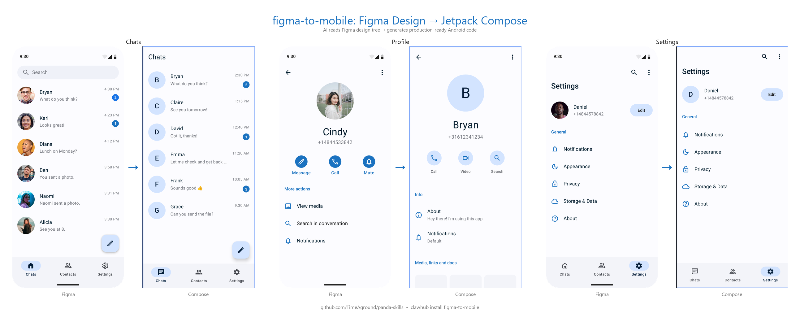

# figma-to-mobile

[](LICENSE)
[](https://python.org)
[](#supported-platforms)

> Convert Figma designs to production-ready mobile UI code using AI — with full awareness of your existing project resources.

**Jetpack Compose** · **Android XML** · **SwiftUI** · **UIKit**

## ✨ What It Does

Paste a Figma design link → get idiomatic mobile UI code that reuses your project's existing colors, strings, drawables, and components. Not pixel-positioned boxes — real layouts using `LazyColumn`, `Row`, `VStack`, `UITableView`, etc.


*Left: Figma design · Right: Generated Jetpack Compose code running in Android Studio*

## 🧠 How It Works

1. **Fetch** — Python script calls Figma REST API to extract the full node tree (auto-layout, style refs, component variants). Supports multi-node comparison for multi-state components (default/hover/disabled).
2. **Scan** — Scans your existing project to build a resource index: colors, strings, drawables, custom Views, Composables, and Gradle dependencies.
3. **Interpret** — AI analyzes layout semantics: "6 similar rows → `LazyColumn`", "horizontal stack with spacing → `Row`"
4. **Generate** — Outputs platform-idiomatic code that **reuses existing resources** (matches Figma color values to your `colors.xml` / `Color.kt` entries; matches images to your drawable names) instead of hardcoding hex values.
5. **Iterate** — Refine through natural language: *"make the header sticky"*, *"switch to dark theme"*
6. **Learn** — Feedback is logged and analyzed by `feedback_analyze.py`, which surfaces rule improvement candidates that get merged back into `references/`.

## 🔑 Key Differentiators

| | Screenshot-based tools | Other Figma plugins | figma-to-mobile |
|---|---|---|---|
| **Input** | Screenshot / image | Figma API (design tree) | Figma API (design tree) |
| **Layout** | Pixel positions | Auto-layout semantics | Auto-layout semantics |
| **Project awareness** | ❌ | ❌ | ✅ Scans existing resources |
| **Color matching** | Hardcoded hex | Hardcoded hex | Matches your `colors.xml` / `Color.kt` |
| **Component reuse** | ❌ | ❌ | ✅ Detects your custom Views |
| **Feedback loop** | ❌ | ❌ | ✅ Logs errors → improves rules |
| **Multi-state support** | ❌ | Limited | ✅ Compares multiple nodes at once |
| **Cost** | Paid subscription | Varies | Free & open source |

## 🚀 Quick Start

### 1. Install

Works with any AI coding assistant that supports agent skills:

```bash
# OpenClaw
clawhub install figma-to-mobile

# Claude Code — copy to your project
cp -r figma-to-mobile/ your-project/.claude/skills/

# GitHub Copilot — copy to your project
cp -r figma-to-mobile/ your-project/.agents/skills/
```

### 2. Use

```
Convert this to Jetpack Compose:
https://www.figma.com/design/xxx/Project?node-id=100-200
```

The AI agent will:
1. Fetch the Figma design tree
2. Scan your project's existing resources
3. Ask clarifying questions if needed
4. Generate production-ready code files that reference your existing colors, strings, and components

> **Figma Token** — Required on first use. If `FIGMA_TOKEN` is not set, the agent will prompt you to paste your token (Figma → Settings → Security → Personal Access Tokens) and save it to `.env` automatically.

## Supported Platforms

| Platform | Framework | Key Features |
|---|---|---|
| **Android** | Jetpack Compose | Material3, LazyColumn/Row, Navigation, ViewModel-ready |
| **Android** | XML | ConstraintLayout, RecyclerView, DataBinding-ready |
| **iOS** | SwiftUI | SF Symbols, NavigationStack, @Observable |
| **iOS** | UIKit | Auto Layout, UICollectionView, programmatic UI |

## 🏗 Architecture

```
figma-to-mobile/
├── SKILL.md                      # AI agent instructions
├── scripts/
│   ├── figma_fetch.py            # Figma API fetcher (single node / multi-node compare / SVG export)
│   ├── project_scan.py           # Multi-platform project scanner entry point
│   ├── feedback_analyze.py       # Parses feedback-log.md → generates rule improvement candidates
│   └── scanners/
│       ├── android_scanner.py    # Android platform detector + scanner
│       ├── android_resources.py  # colors.xml / strings.xml / dimens.xml / styles.xml
│       ├── android_drawables.py  # Shape drawable attribute extraction
│       ├── android_layouts.py    # Layout XML analysis, View usage stats
│       ├── android_views.py      # Custom View subclass scanner (Kotlin/Java)
│       ├── android_deps.py       # Gradle dependency graph builder
│       ├── ios_scanner.py        # iOS platform scanner
│       ├── ios_resources.py      # colorset / .strings / NSLocalizedString
│       ├── ios_assets.py         # xcassets / imageset scanner
│       └── ios_views.py          # UIKit / SwiftUI View definition scanner
├── references/
│   ├── figma-interpretation.md   # Which nodes to skip, Container+Icon merge rules, multi-state detection
│   ├── generation-rules.md       # Resource match priority, drawable generation conditions, naming rules
│   ├── scan-usage.md             # How to use scan results (color / string / image matching)
│   ├── compose-patterns.md       # Figma node → Jetpack Compose mapping rules
│   ├── xml-patterns.md           # Figma node → Android XML mapping rules
│   ├── swiftui-patterns.md       # Figma node → SwiftUI mapping rules
│   └── uikit-patterns.md         # Figma node → UIKit mapping rules
└── tests/
    └── test_project_scan.py      # Scanner integration tests
```

## Requirements

- Python 3.8+ with `requests`
- Figma Personal Access Token (free)
- An AI coding assistant (OpenClaw, Claude Code, GitHub Copilot, etc.)

## License

MIT
